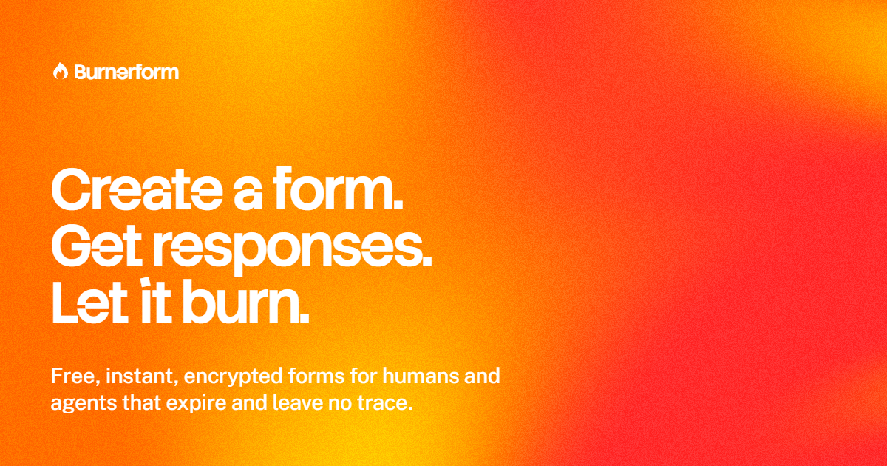

# Burnerform

<p align="center">
  <a href="https://burnerform.com">
    
  </a>
</p>

<p align="center">
  Browser-encrypted forms for people and agents.
</p>

<p align="center">
  <a href="https://burnerform.com"><strong>Create a form</strong></a>
  ·
  <a href="https://burnerform.com/docs">Read the docs</a>
  ·
  <a href="https://burnerform.com/docs/getting-started">Connect an agent</a>
</p>

Burnerform collects what you need, then gets out of the way. Every form has an
expiry and response limit. Responses are encrypted in the respondent's browser
before upload, stored as ciphertext, and decrypted only by an authorized
reader.

This repository contains the public TypeScript packages, local MCP server,
conformance fixtures, and agent skill that power the Burnerform lifecycle.

## The lifecycle

1. **Draft** a form locally.
2. **Publish** it and receive both the public and management links.
3. **Collect** browser-encrypted responses.
4. **Read** responses through authorized local custody.
5. **Burn** the form when the work is finished.

The SDK and MCP server keep private recovery material, management keys, and
passwords outside the model context. Response plaintext stays out of the
Burnerform server.

## Choose your entry point

| Package                                    | Use it for                                                        |
| ------------------------------------------ | ----------------------------------------------------------------- |
| [`@burnerform/mcp`](./packages/mcp)        | Giving Codex and other MCP clients the complete form lifecycle    |
| [`@burnerform/sdk`](./packages/sdk)        | Building form creation and response workflows in Node.js          |
| [`@burnerform/core`](./packages/core)      | Using the canonical schema, API contracts, and browser crypto     |
| [`skills/burnerform`](./skills/burnerform) | Teaching supported agents Burnerform's workflow and custody rules |

All three npm packages share one compatibility version.

## Connect Codex

Install the local MCP server:

```sh
npm install --global @burnerform/mcp
```

Register it with Codex:

```sh
codex mcp add burnerform \
  --env BURNERFORM_BASE_URL=https://burnerform.com \
  -- burnerform-mcp
```

Then install the
[Burnerform skill](https://burnerform.com/docs/skill) so Codex knows how to
draft, publish, recover, manage, and burn forms without exposing private
custody material.

[Open the complete MCP setup guide](https://burnerform.com/docs/mcp).

## Use the TypeScript SDK

```sh
npm install @burnerform/sdk
```

The Node.js SDK coordinates publication, encrypted local custody, recovery,
response reading, settings changes, and burn operations. Browser exports
provide the public form and response cryptography needed by compatible
clients.

[Read the TypeScript SDK guide](https://burnerform.com/docs/typescript-sdk).

## Security by construction

Burnerform narrows the amount of trust placed in the service:

- Responses are encrypted before upload.
- The server stores response ciphertext, never plaintext answers.
- Decryption and CSV generation happen locally.
- Management keys stay out of URLs, logs, and persisted plaintext.
- Passwords and private recovery material remain in local custody.
- Expiry and burn delete responses, sessions, public content, and wrapped key
  material.

Public-form passwords, creator passwords, shared-reader access, and recovery
files are available when a workflow needs them.

Burnerform is not designed for payments, regulated data, respondent file
uploads, rich HTML, or permanent record keeping.

Read the [security and custody guide](./docs/security-and-custody.mdx), the
[cryptographic protocol](./docs/cryptographic-protocol.mdx), and the
[conformance fixtures](./conformance).

## What is public here

```text
packages/core/       Canonical schemas, contracts, and cryptography
packages/sdk/        Browser and Node.js clients with local custody
packages/mcp/        Local stdio MCP server and tool registry
skills/burnerform/   Agent workflow and custody instructions
conformance/         Cross-runtime protocol fixtures
docs/                Public developer and security documentation
```

The application, database, deployment configuration, and private operational
code are outside this repository.

## Develop and verify

You need Node.js 24 and pnpm 11.

```sh
pnpm install --frozen-lockfile
pnpm format
pnpm lint
pnpm typecheck
pnpm test
pnpm conformance
pnpm packages:check
pnpm skill:check
pnpm mcp:smoke
```

The test suite covers schema validation, cryptographic tampering, local
custody, SDK behavior, MCP tools, and cross-runtime fixtures. Package checks
inspect the exact files intended for npm publication.

See [CONTRIBUTING.md](./CONTRIBUTING.md) before opening a pull request.

## Security reports

Do not open a public issue for a suspected vulnerability. Use the private
contact method at [burnerform.com/security](https://burnerform.com/security).

## License

Burnerform's public packages, MCP server, skill, fixtures, and documentation
are available under the [Apache License 2.0](./LICENSE).
